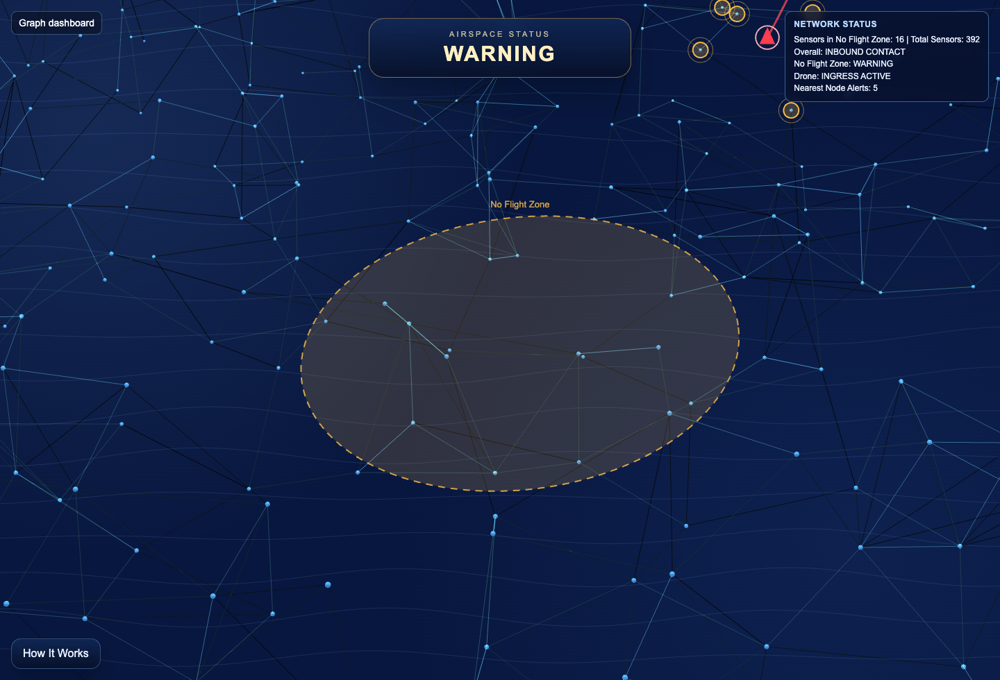
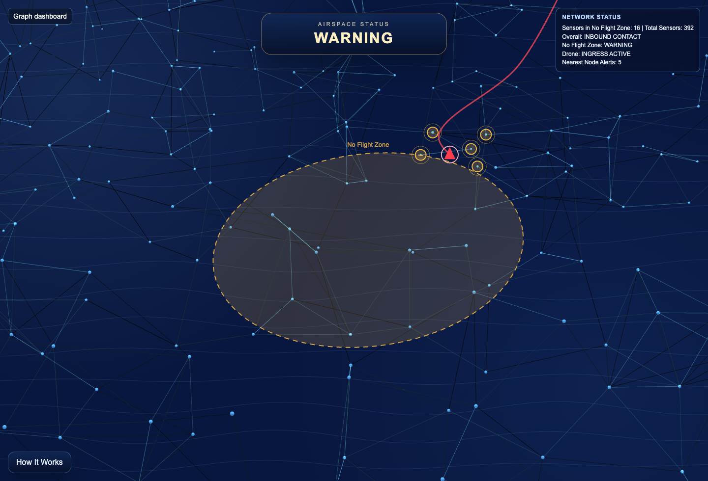
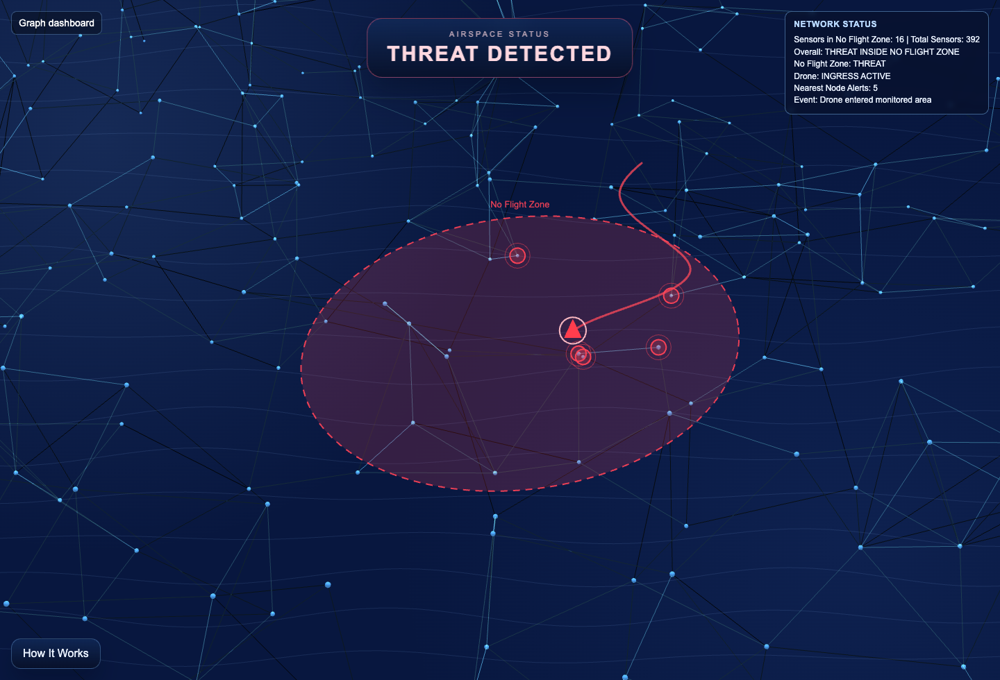

# Graph Dashboard

A sensor-field demo with realtime thread detection and fencing of area AKA no flight zone.

## Live Demo

`https://syzer.github.io/graph-dashboard/`

## What it does
- Overlays a terrain-style sensor space on top of the network
- On click, animates a drone entering the monitored area
- Highlights the nearest Vanta nodes in warning yellow during ingress
- Displays live status in the top-right panel

## Screenshots







## Run locally

Open `index.html` directly:

```bash
open index.html
```

Or serve with a local server:

```bash
python3 -m http.server 8000
```

Then visit `http://localhost:8000`.

## Files

- `index.html` - full page and animation logic
